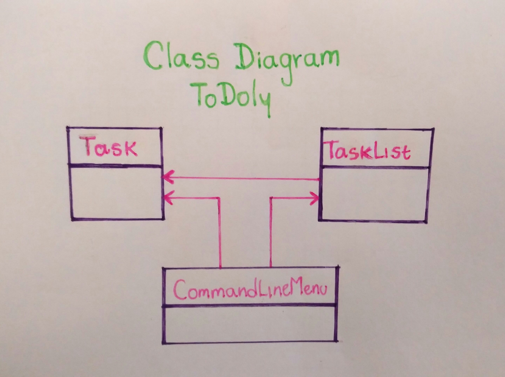

# ToDoly

This is command-line to-do list application with a text based user interface that allows the user to create new tasks, assign them a title and due date, and choose a project for that task to belong to.

## Development

To run this project locally use the following command:

`gradle run`

To run the tests use the following command:

`gradle test`

## Build

To build the binary that runs the standalone version of ToDoly use the following command:

`gradle assemble`

You will find the ZIP file that contains the binary in this folder `todoly/build/distributions/`

## Class diagram

## Credits

Made by Gloria Morales
